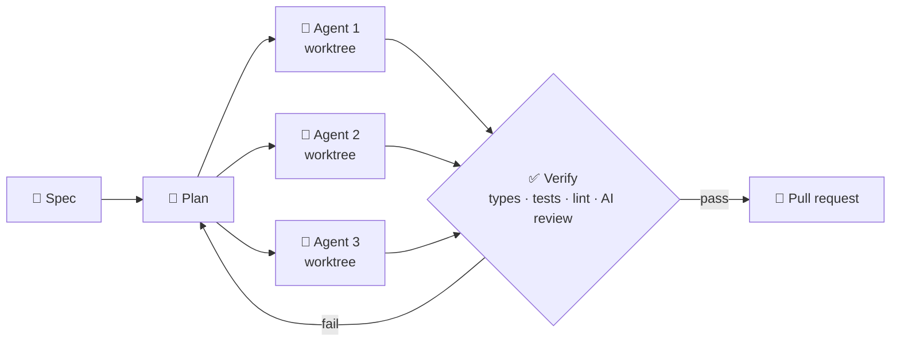

  <h1>Hi, I'm Mykyta 👋</h1>
  
  

    
    
    
    
  

---

### 🧑‍💻 About me

Full-Stack Engineer with **5+ years** building web products end to end, from database design and APIs to background jobs, integrations and UI.

> Most of my commercial work lives in private company repos under NDA. Here's what it adds up to.

### 📈 Highlights

| Impact | Details |
|:--|:--|
| ⚡ **~50h → 1–2h** | Product creation time on a jewelry catalog platform I built from scratch |
| 🚚 **~$600k/mo brand** | Migrated to our loyalty platform in production with all points and reward codes |
| 🔌 **17 integrations** | Built on a shared event bus for an e-commerce loyalty platform |
| 🌍 **15+ languages** | AI translation app handling ~1,000 translations a day for a large online store |
| 🚀 **−85% API latency** | By rewriting slow MongoDB queries |
| 🛡️ **Security fixes** | NoSQL injection, mass assignment, XSS and IDOR found and closed |

### 🛠️ Tech stack

   
   
  

  
  
  
  
  
  

### 🤖 How I work with AI

I build my own dev harness around AI agents: specs go in, reviewed pull requests come out.

---

  <b>Open to full-stack roles, remote or hybrid.</b> Let's talk: <a href="mailto:coldxdev@gmail.com">coldxdev@gmail.com</a>

